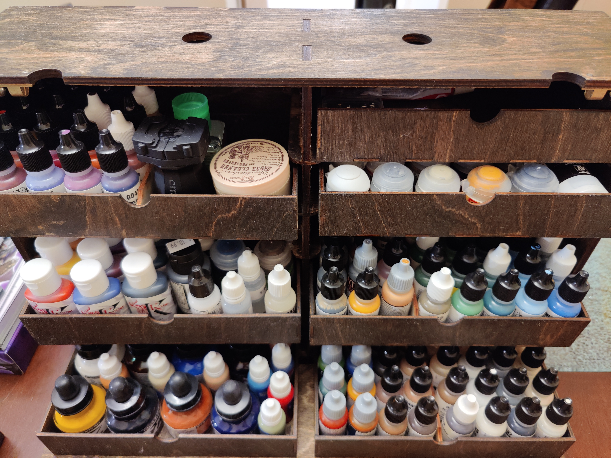
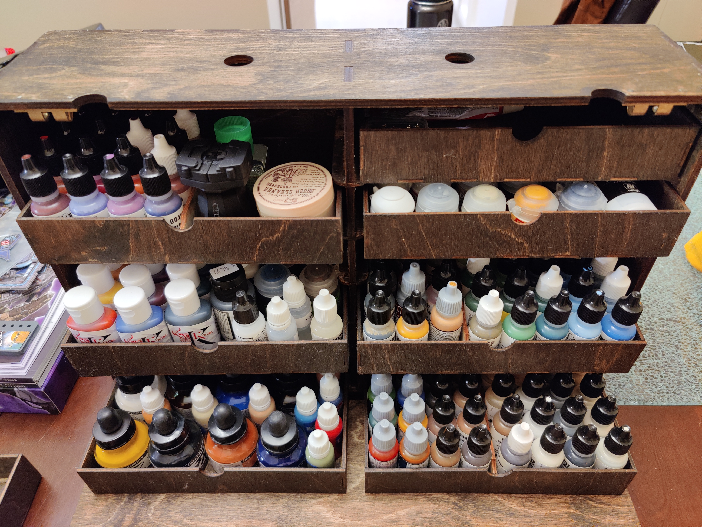

# Paint Case v1.0

Paint case for carrying miniatures and painting supplies. The case and drawers are intended to be laser cut from wood, but any material would work as long as you have a way to assemble them together.

# End Result Photos

# Cost Summary

| Part | Number | Cost/Item | Total |
| ---                                                     | --: | --: |  --: |
| Cutting cost (1 case, 8 drawers, and 1 set of dividers) |   1 | 120 |  120 |
| Hinges for bottom/front (2 packs)                       |   2 |   6 |   12 |
| Latches for top/front (4 pack)                          |   1 |  10 |   10 |
| Handle for carrying (2 pack)                            |   1 |  10 |   10 |
| Wood glue                                               |   1 |  10 |   10 |
| Varnish for finishing                                   |   1 |  10 |   10 |
|                                                         |     | --- |  --- |
| **Total**                                               | ... | ... | $172 |

All the prices above are mostly from memory, so they are approximate. Obviously some of the stuff you may have at home: specifically the wood glue and the varnish. Additionally, if you didn't want to varnish the case then you could omit that.

Finally, the cutting cost includes "design" help from the person cutting it (see below). So that could be much lower for you if you just take the parts and cut them as-is (see #Warranty).

# Inspiration

- [Frontier Wargaming's Paint Case 2.0](https://frontierwargaming.com/product/paint-case/)

# Features

- Briefcase-style portability.
- Eight sections of drawers.
- All sections of drawers support lids.
  - If you were so inclined, you could make 12 sections with magnetized drawers and lids to have increased miniature storage.
- Room on the inside of the front cover for a standard self-healing cutting mat.
- Drawers are all the same dimensions, so you don't need to remember "this drawer for paint, this drawer for tools" etc.
- Drawers have flexible dividers so you aren't stuck just quartering each drawer.
- Bottom drawers have an appropriate hight for standard ~17ml dropper bottles (measurements below).
  - As a bonus, this happens to include fancier paints like Vallejo Metal Color dropper bottles and Kimera Kolors dropper bottles, both of which have a slightly different footprint but have a similar height.

# Tools

- [Basic Box Generator](https://www.makercase.com/#/basicbox): Making the starting boxes for everything.
- LibreCAD: Most of the other work.

# Specific Measurements

## Case Dimensions

|                       | Height | Width | Depth |
| --------------------- | ------ | ----- | ----- |
| **Case Dimensions**   | 320mm  | 460mm | 120mm |
| **Drawer Dimensions** | 40mm   | 214mm | 108mm |

This leaves room for a 3mm lid on the top two drawers on each side of the center divider.

## Prefered Material Thickness

- Outside and divider: 6mm
- Drawers and supports: 3mm

## Content Height

| Item                            | Height | Diameter    |
| ------------------------------- | ------ | ----------- |
| **Citadel tall pots**           | 60mm   | 32mm        |
| **Kimera Kolors dropper**       | 75mm   | 34mm x 24mm |
| **Reaper Paints dropper**       | 76mm   | 25mm        |
| **Vallejo Game Color dropper**  | 79mm   | 25mm        |
| **Vallejo Metal Color dropper** | 75mm   | 35mm        |

# TODO

- [x] I need to find a handle for the top somehow.
- [ ] Figure out an LED solution. The lightbar is fine, but I feel I could do better than that, perhaps using some stray LEDs on a strip of wood.
- [ ] Adhere metal to the bottom of some of the drawers.

# Who did the cutting?

I currently live in Minnesota in the United States, so my goal was to find someone local. I found [Linnell Design](https://linnelldesign.com/) after a few tries. Mostly people either didn't cut wood (which was surprising to me), didn't respond at all, or stopped responding after I detailed my requirements.

I'd recommend going local so that testing things can go a little smoother and you can also pick up your case parts without fear of them being damaged in shipping.

If you are looking for a larger, non-local place, [Ponoko](https://ponoko.com) does wood cutting. But _this has not been tested on there_ so upload the files and pay your money at your own risk.

# Warranty

This is a work in progress. If you decide to laser cut any of these cases don't come complaining to me if they don't fit together properly.

# Version History

## v1.0

Finished varnishing case and proceeded to transport it cross country in a car. Everything arrived in one piece and not a single paint pot was out of place!

## v0.3

Test cuts were successful!

- Going to print full case shortly. Next update should hopefully be `v1.0`.

## v0.2

Test cuts were unsuccessful. The corner joints were slightly too loose, so they would not have stuck together well.

- Widened one side of all finger joints by .5mm.

## v0.1

Initial commits. Figuring out wood thickness.

- Drawers and supports are now 3mm thick.
- Outside case and center divider is now 6mm thick.
